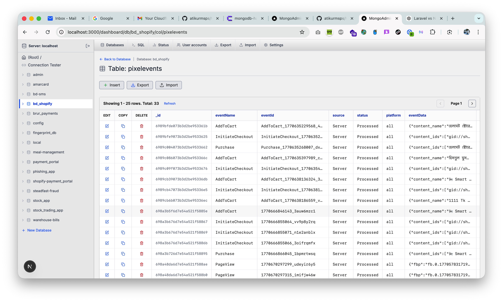
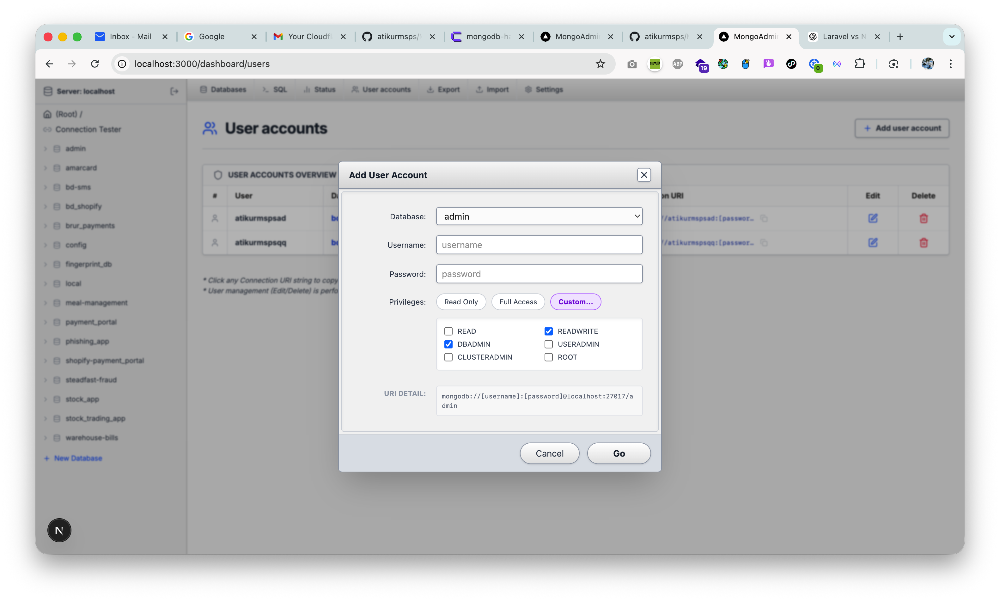
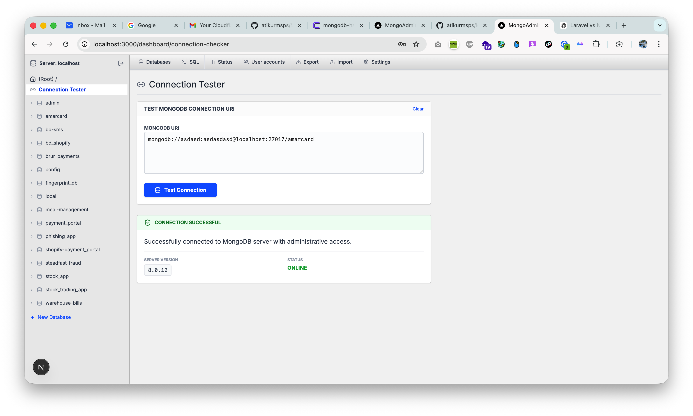
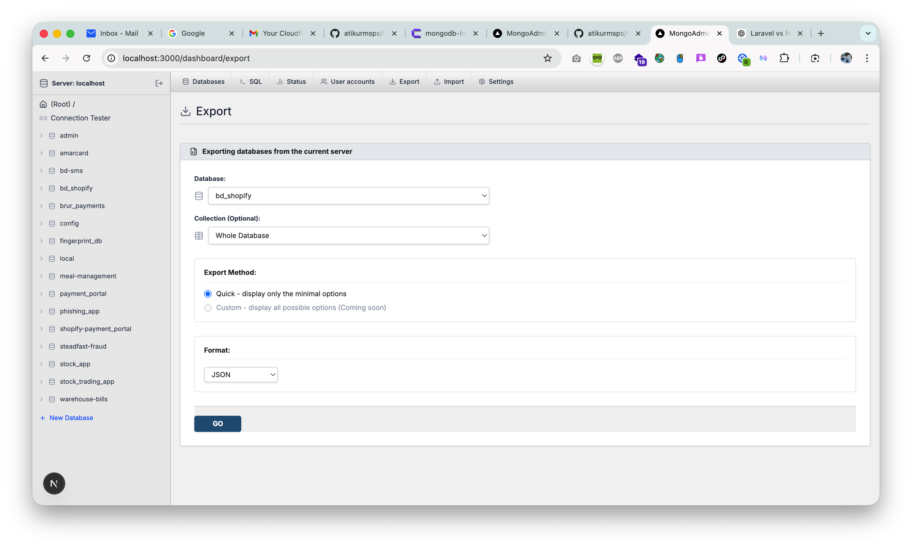

# 🍃 MongoAdmin - Premium MongoDB GUI & Admin Panel

[](https://nextjs.org/)
[](https://tailwindcss.com/)
[](https://www.mongodb.com/)
[](LICENSE)

**MongoAdmin** is a high-performance, open-source MongoDB administration interface inspired by the simplicity of phpMyAdmin. Built with **Next.js 15**, it provides a sleek, modern, and intuitive way to manage your MongoDB databases, collections, and user accounts.



---

## ✨ Key Features

### 📂 Database & Collection Management
Manage your entire MongoDB server from a single interface. Create, delete, and browse databases and collections with ease.
- **Visual Data Browser**: Navigate through your documents in a clean, tabular format.
- **CRUD Operations**: Insert, edit, and delete documents with a few clicks.
- **Advanced Filtering**: Quickly find exactly what you're looking for.

### 👥 User Account Control
Complete MongoDB user management at your fingertips.
- **Create Users**: Add new users with specific roles and permissions.
- **Privilege Management**: Assign roles like `readWrite`, `dbAdmin`, and `root`.
- **Live Connection URIs**: Automatically generates complete connection strings (SRV and standard).



### 🛠️ Developer Tools
- **Connection Tester**: Verify your MongoDB connection strings instantly.
- **Export/Import**: Move your data seamlessly between environments.
- **Responsive Design**: Fully optimized for desktops, tablets, and mobile devices.

---

## 📸 Screenshots

| Data Explorer | Connection Tester | Export Data |
| :---: | :---: | :---: |
|  |  |  |

---

## 🚀 Getting Started

### 1. Prerequisites
- Node.js 18+ 
- A running MongoDB instance

### 2. Installation
```bash
# Clone the repository
git clone https://github.com/atikurmsps/MongoDB-GUI-Admin-Panel.git

# Navigate to the directory
cd MongoDB-GUI-Admin-Panel

# Install dependencies
npm install
```

### 3. Environment Setup
Create a `.env.local` file in the root directory:
```env
MONGODB_URI=mongodb://your_connection_string
ADMIN_USERNAME=admin
ADMIN_PASSWORD=your_secure_password
JWT_SECRET=your_random_secret_key
```

### 4. Run Development
```bash
npm run dev
```
Open [http://localhost:3000](http://localhost:3000) to start managing your data.

---

## 🛠️ Technology Stack
- **Frontend/Backend**: [Next.js 15](https://nextjs.org/) (App Router)
- **Styling**: [Tailwind CSS](https://tailwindcss.com/)
- **Icons**: [Lucide React](https://lucide.dev/)
- **Database Driver**: [MongoDB Node.js Driver](https://www.mongodb.com/docs/drivers/node/current/)
- **UI Components**: [Shadcn UI](https://ui.shadcn.com/) / Radix UI

---

## 🤝 Contributing
Contributions are what make the open-source community such an amazing place to learn, inspire, and create. Any contributions you make are **greatly appreciated**.

1. Fork the Project
2. Create your Feature Branch (`git checkout -b feature/AmazingFeature`)
3. Commit your Changes (`git commit -m 'Add some AmazingFeature'`)
4. Push to the Branch (`git push origin feature/AmazingFeature`)
5. Open a Pull Request

---

## 📝 License
Distributed under the MIT License. See `LICENSE` for more information.

---

**Built with ❤️ for the MongoDB Community.**
